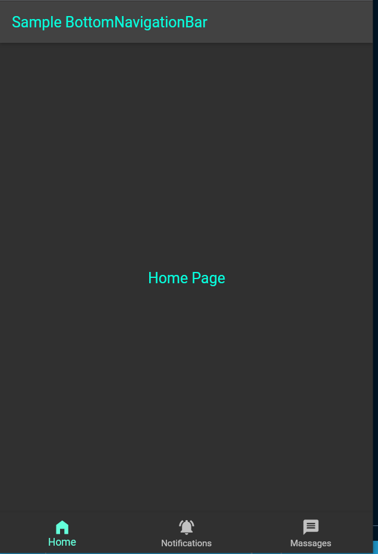

# bottom_navigation_bar_example
Flutter BottomNavigationBar Example .
## Flutter BottomNavigationBar Example
Sample BottomNavigationBar Widget Example in Flutter.
## ScreenShot
| Sign-In Screen                                |
| --------------------------------------------- |
|          |
## Steps
<pre>
1:Create StatelessWidget BottomNavigationBarExample 
2:Create an integer variable _selectedIndex to store the index of BottomNavigationBar 
3:Create a List of Widgets named _bodyContent to store the Pages associated with each BottomNavigationBarItem 
 3.1:Give the body Page Widgets inside this List 
4:create a void function named _changeIndex to change the _selectedIndex variable to selected index of BottomNavigationBarItem using setState() 
 4.1:Give a parameter of type integer named index to the function 
5:Add property bottomNavigationBar: to the Scaffold 
 5.1:Add Widget BottomNavigationBar 
 5.2:set property currentIndex: of BottomNavigationBar as _selectedIndex  
 5.3:set property onTap:  of BottomNavigationBar as _changeIndex 
 5.4:set property items: of BottomNavigationBar as children containing BottomNavigationBarItem 
 5.5:set property icon: of BottomNavigationBarItem as Icon of BottomNavigationBarItem
 5.6:set property label: of BottomNavigationBarItem as label Name of BottomNavigationBarItem
6:Add body to the Scaffold
 6.1:set the body as Widgets of List _bodyContent using the list function elementAt() and giving the index as _selectedIndex
 </pre>
